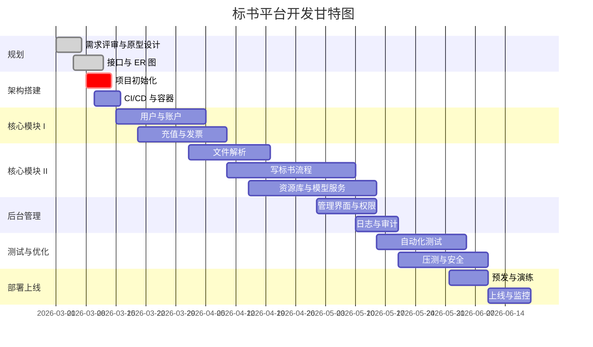

# 开发计划与文档模板

## 1. 任务拆分

### 阶段 1：规划与原型
1.1 需求评审与确认
1.2 原型设计（Figma）
1.3 数据库 ER 图设计
1.4 接口列表与 OpenAPI 草稿

### 阶段 2：基础架构搭建
2.1 前端项目初始化（Vue3 + TypeScript + Vite）
2.2 后端项目初始化（NestJS + TypeScript）
2.3 CI/CD 管道搭建（GitHub Actions）
2.4 容器化基础（Dockerfile、Compose/Helm）
2.5 JWT + RBAC 中间件

### 阶段 3：核心模块 I
3.1 用户认证（手机号验证码、用户名密码、密码重置）
3.2 个人/企业账户模型与切换逻辑
3.3 个人/企业中心页面与接口
3.4 充值订单与会员权益
3.5 发票开具流程

### 阶段 4：核心模块 II
4.1 招标文件解析服务
4.2 写标书各流程界面及后端
4.3 资源库（图表、产品、资料）
4.4 模型服务封装

### 阶段 5：后台管理
5.1 超级管理员界面基础框架
5.2 用户/权限管理
5.3 配置大模型、发票接口
5.4 日志与审计功能

### 阶段 6：测试与优化
6.1 单元测试覆盖
6.2 集成测试与回归
6.3 并发压力测试
6.4 安全扫描与修复

### 阶段 7：部署与上线
7.1 预发环境搭建与冒烟
7.2 部署文档与培训
7.3 备份与回滚方案
7.4 正式上线与监控开启


## 2. 里程碑甘特图



> 上述日期为示例，实际根据团队资源可调整。


## 3. API 文档模板

```yaml
openapi: 3.0.0
info:
  title: 标书平台 API
  version: '1.0.0'
servers:
  - url: https://api.example.com/v1
paths:
  /auth/login:
    post:
      summary: 用户登录
      requestBody:
        required: true
        content:
          application/json:
            schema:
              type: object
              properties:
                type:
                  type: string
                  enum: ["sms","password"]
                mobile:
                  type: string
                password:
                  type: string
                code:
                  type: string
      responses:
        '200':
          description: 登录成功
          content:
            application/json:
              schema:
                $ref: '#/components/schemas/AuthResponse'
  /users/me:
    get:
      summary: 获取当前用户信息
      security:
        - bearerAuth: []
      responses:
        '200':
          description: 用户信息
          content:
            application/json:
              schema:
                $ref: '#/components/schemas/User'
components:
  securitySchemes:
    bearerAuth:
      type: http
      scheme: bearer
      bearerFormat: JWT
  schemas:
    AuthResponse:
      type: object
      properties:
        token:
          type: string
        expiresIn:
          type: integer
    User:
      type: object
      properties:
        id:
          type: string
        username:
          type: string
        mobile:
          type: string
        email:
          type: string
        role:
          type: string
```

> 按此模板继续补充其他资源，如招标解析、标书管理、订单、发票等。

## 4. CI 安全门禁策略（当前基线）

- 目标：在不阻塞日常迭代的前提下，先建立可执行的安全门禁。
- 依赖漏洞：`backend` 执行 `npm audit --audit-level=high`，高危及以上阻断合并。
- 密钥泄露：执行 `gitleaks`，命中即阻断合并。
- 代码扫描：执行 `semgrep` 全量扫描并输出 `semgrep-report.json`。
- 分级阻断：`semgrep` 仅 `ERROR` 严重度阻断，其他级别仅告警并保留报告。
- 报告留存：`coverage` 与 `semgrep-report` 作为 CI artifact 归档，用于周度趋势跟踪。
- 迭代策略：每 2~4 周复盘一次误报与漏报，再逐步提升阻断阈值。

## 5. 当前落地进度（2026-02-28）

- 已完成：后端 `lint + typecheck + unit + integration + build` 门禁。
- 已完成：后端关键集成链路（登录、开票审核、异步任务、CSV 导出、Word 导出、权限拦截）。
- 已完成：前端 `typecheck + unit + build` 门禁与 API 层首批单测基线。
- 已完成：前端 Playwright 三条烟雾场景（未登录拦截、密码登录跳转、充值+发票流程）与 CI 任务接入。
- 已完成：安全门禁 `npm audit(high)`、`gitleaks`、`semgrep`（全量报告 + ERROR 阻断）与 `trivy fs`（HIGH/CRITICAL 阻断）。
- 已完成：`semgrep` 分层治理（观察组 `WARNING/INFO` 仅报告，阻断组 `ERROR` 卡门禁），规则执行脚本统一在 `scripts/run-semgrep.sh`。
- 已完成：CI artifact 留痕统一保留 90 天（coverage/semgrep/trivy/perf）。
- 已完成：主干分支性能基线任务（k6），阈值 `p95 < 1500ms`、错误率 `< 1%`。
- 已完成：夜间轻压 + 周基准双节奏性能工作流（`performance-schedule.yml`，支持 `workflow_dispatch` 手动触发）。

下一阶段建议：
- 前端继续扩大覆盖范围（`enterprise/model/parse` API 与关键页面状态逻辑）。
- 固定性能趋势看板（按 nightly/weekly 两类 artifact 做趋势归档与阈值复盘）。
- 安全规则分层治理（逐步将低噪音规则提升为阻断级）。
- 定期（2~4 周）复盘 `semgrep-observe` 报告，将稳定低噪音规则逐步提升到阻断组。

性能任务手动执行入口（GitHub Actions）：
- 在 `Actions -> CI -> Run workflow` 可手动触发主基线任务，参数：`perf_vus`、`perf_duration`。
- 在 `Actions -> Performance Schedule -> Run workflow` 可选择 `nightly/weekly/both` 运行档位。
- 产出物在 Artifacts 查看：`performance-k6` / `performance-k6-nightly` / `performance-k6-weekly`。

上线前核对建议使用：`docs/release_checklist.md`。

---

以上内容可以直接复制到项目文档中，便于团队跟进与执行。欢迎根据实际需要调整里程碑时间与任务详情。